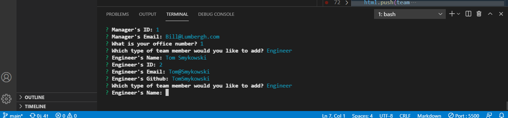

# teamProfileGenerator
10-OOP Homework

## Project Description
Build a Node.js command-line application that takes in information about employees on a software engineering team, then generates an HTML webpage that displays summaries for each person. Testing is key to making code maintainable, so you’ll also write a unit test for every part of your code and ensure that it passes each test.

## Installation
npm init -y, npm i

## Tests
npm run test

## Screenshot and link to live demo

[Demo](https://drive.google.com/file/d/11-jtlH48YhWs9PqLGB7MXcDHC_gHkhgm/view)

### Questions
If you have any questions, please refer to my Github page, [JamieKaczor](https://github.com/JamieKaczor), or contact me through my email, Dignanjk@aol.com